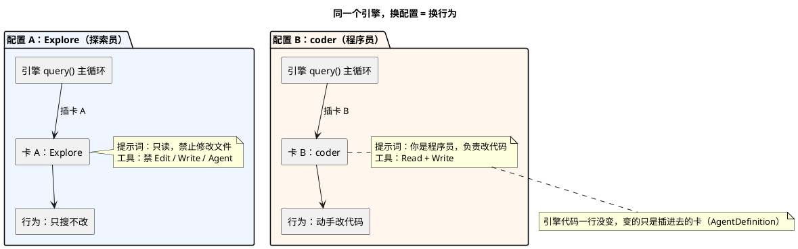
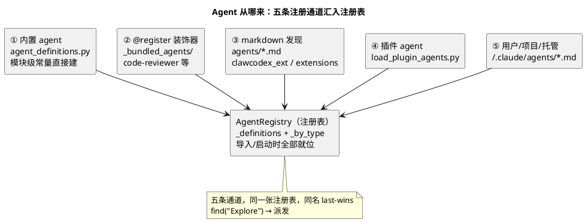
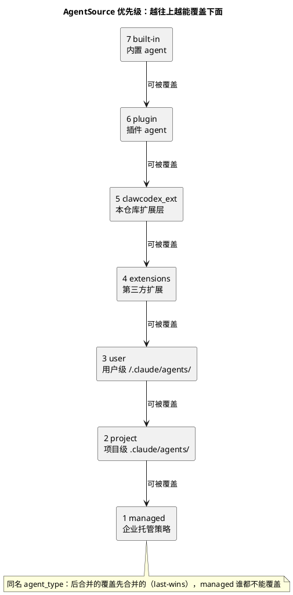
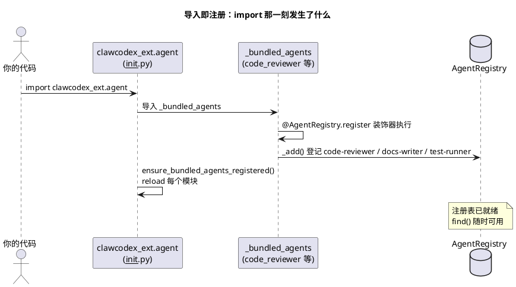
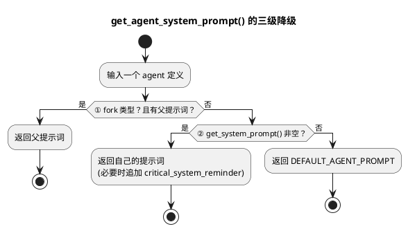
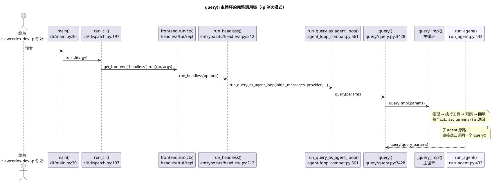
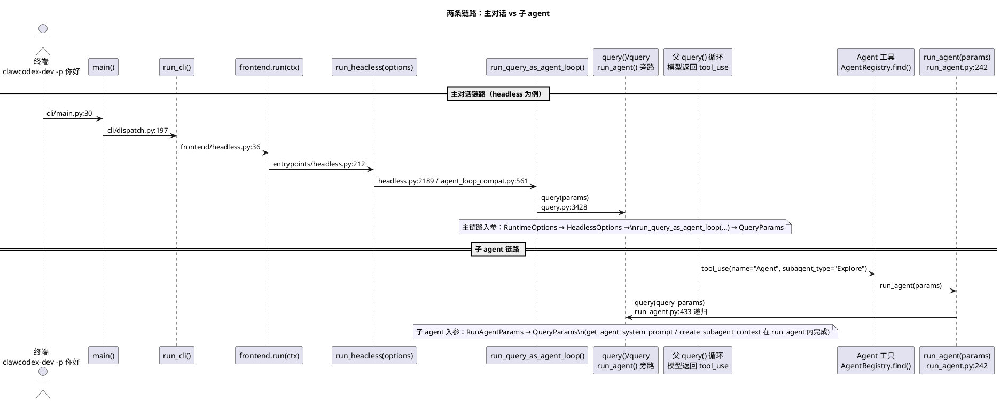
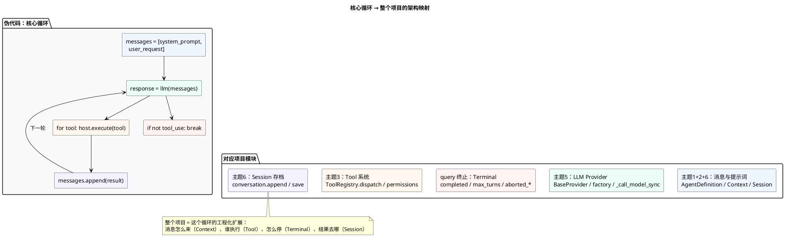

# 主题 1：Agent —— agent 就是"配置包"（重构版）

> 学习顺序：**Agent → Context → Tool → Memory → LLM Provider → Session → Skill → SubAgent**
> 本章目标：看懂 `AgentDefinition` 数据结构、预置 agent 的定义、注册机制、系统提示词怎么生成，并理解"同一个引擎、换配置 = 换行为"。
> 阅读代码前先跑一遍：`cd clawcodex-ascend && uv run clawcodex-dev -p "你好"`（或任意一句问候），看看它怎么响应。
> 本版特点：伪代码 → 真实代码两层递进；代码都标注源文件名；配 11 张**内嵌 PlantUML 示意图**（不依赖外置图片，渲染方式见文末附录）。

---

## 1. 它是什么

"Agent"在这个项目里有两层意思，先分清：

| 层 | 意思 | 类比 |
|----|------|------|
| 第 1 层：整个程序 | 你运行 `clawcodex-dev`，这个程序整体就是一个 agent —— 能听懂任务、调用工具、完成任务 | 一个"员工" |
| 第 2 层：agent 定义 | 程序里预置了多个不同"性格/能力"的 agent（主 agent、Explore 探索员、Plan 规划师、code-reviewer 代码审查员…）。每个 agent 是一个 `AgentDefinition` **数据对象** | 员工的"岗位说明书" |

本章学第 2 层。**核心心法一句话：**

> **agent 就是一个"配置包"——给同一个引擎（`query()` 主循环）换上不同的配置（提示词 + 工具 + 模型），就有不同行为的 agent。**

换句话说，引擎是固定的"机器"，`AgentDefinition` 是插进机器的"程序卡"。



**这张图讲了三件事：**
1. **上面是同一个引擎**（左右两侧的"引擎"框一模一样）——引擎代码一行没改。
2. **中间是两张不同的"卡"**（`AgentDefinition`）：卡 A 只读、卡 B 能写，提示词和工具都不同。
3. **下面是两种结果**：同一台机器，插卡 A 就"只搜不改"，插卡 B 就"动手改代码"。

> **用法小示例：两个 agent，同一个引擎**
>
> ```python
> # 卡 A：只读探索员（概念示意，先不用管真实字段）
> explorer = AgentDefinition(
>     agent_type="Explore",
>     tools=[],                # 假装：只能读
>     get_system_prompt=lambda: "你是只读探索员，禁止修改任何文件",
> )
>
> # 卡 B：写代码的程序员
> coder = AgentDefinition(
>     agent_type="coder",
>     tools=["Read", "Write"],  # 假装：能读能写
>     get_system_prompt=lambda: "你是程序员，负责修改代码",
> )
> ```
>
> 模型说"帮我找找这个函数在哪" → 引擎插上卡 A（Explore），只搜不改；模型说"帮我实现这个函数" → 引擎插上卡 B（coder），动手改文件。**引擎的代码一行没变，变的只是插进去的卡。**

### 为什么先学它

后面 7 个主题（Context / Tool / Memory / Provider / Session / Skill / SubAgent）讲的都是"这个引擎的零件"。先认识 `AgentDefinition` 这个"总装清单"，后面每个零件学完都能回来对号入座——它就是那张把一切串起来的索引表。

---
## 2. 代码在哪

主题 1 只需要看 4 个文件（按阅读顺序）：

| 文件 | 看什么 | 重点标注 |
|------|--------|----------|
| `clawcodex_ext/agent/agent_definitions.py` | `AgentDefinition` 数据结构 + 4 个内置 agent | **必读**，先读这个 |
| `clawcodex_ext/agent/registry.py` | `AgentRegistry` 注册表 + `register` 装饰器 | 必读 |
| `clawcodex_ext/agent/prompt.py` | `get_agent_system_prompt()` 生成系统提示词 | 扫读 |
| `clawcodex_ext/agent/run_agent.py` | 子 agent 执行器（第 8 章细讲） | **只看 `run_agent()` 的注释和参数表**，别深入 |

> 为什么先读 `agent_definitions.py`？因为它定义了"一个 agent 由哪些字段组成"——这是整个 agent 体系的**数据契约**，其他文件都是围绕它转的。

> **用法小示例：打开 Python 交互环境，直接看注册表里有什么**
>
> ```bash
> cd clawcodex-ascend
> uv run python
> ```
>
> ```python
> >>> from clawcodex_ext.agent import AgentRegistry
> >>> for a in AgentRegistry.all():
> ...     print(a.agent_type, "|", a.source)
> ...
> code-reviewer | clawcodex_ext    # 扩展层注册的
> docs-writer   | clawcodex_ext
> test-runner   | clawcodex_ext
> >>> AgentRegistry.find("code-reviewer")   # 按名字查一个
> AgentDefinition(agent_type='code-reviewer', source='clawcodex_ext', ...)
> ```
>
> （实际输出以你的环境为准；重点是：**导入包 → 注册表就有数据 → 能查能列**。这就是后面要讲的"导入即注册"。）

### 顺带认识：agent 模块全家桶

`clawcodex_ext/agent/` 目录下还有几十个文件，现在不用全看，但知道分工有好处：

| 文件/目录 | 职责 | 哪个主题学 |
|-----------|------|-----------|
| `agent_definitions.py` | AgentDefinition + 内置 agent | **本章** |
| `registry.py` | 注册表 | **本章** |
| `prompt.py` | 系统提示词生成 | **本章** |
| `policy.py` | 提示词"积木"（identity/规范/工具集） | 本章扩展 |
| `_bundled_agents/` | 装饰器注册的扩展 agent 示例 | 本章扩展 |
| `run_agent.py` | 子 agent 执行器 | 主题 8 |
| `subagent_context.py` | 子 agent 隔离上下文 | 主题 8 |
| `session.py` / `conversation.py` / `transcript.py` | 会话、消息历史、存档 | 主题 6 |
| `background_runner.py` / `fork_subagent.py` | 后台子 agent / fork 模式 | 主题 8 |

**"agent 从哪来"一张图看懂**——上面这些文件不是各自为政，而是从 5 条通道把 agent 定义汇进同一个注册表：



而"谁覆盖谁"由来源的优先级决定（同名 `agent_type` 时，越靠上越能覆盖）：



> 优先级细节：`built-in < plugin < clawcodex_ext < extensions < user < project < managed`（见 `load_agents_dir.py:75-83` 的 `_MERGE_ORDER`）。**所以用户可以用自己的 md 覆盖内置 agent，但企业托管的 managed 层谁都不能覆盖。**

---
## 3. 核心概念与代码语法

### 3.1 `AgentDefinition`：一个 agent 长什么样

**伪代码先行**——先不管语法细节，想象一个 agent 定义"长得像什么"：

```python
# 伪代码：一个 agent 定义的核心字段
agent = AgentDefinition(
    名字="Explore",              # agent_type：唯一标识
    简介="什么时候该派我出去",     # when_to_use：给父 agent 看
    工具白名单=None,              # tools：None = 全部
    工具黑名单=["Edit", "Write"], # disallowed_tools：绝不能碰的
    建议模型="haiku",             # model：当前 provider 支持才用
    提示词生成函数=_make_prompt,   # get_system_prompt：函数，不是字符串
)
```

**再看真实代码**（`agent_definitions.py:55-94`）：

```python
@dataclass
class AgentDefinition:
    """Definition for an agent that can be spawned by the Agent tool."""

    agent_type: str                       # 名字，唯一标识（子 agent 用它被点名）
    when_to_use: str                      # 什么时候用这个 agent（给"爸爸"看的介绍）
    tools: list[str] | None = None        # 工具白名单；None 或 ['*'] = 全部工具
    source: AgentSource = "built-in"      # 来源：built-in / user / plugin / clawcodex_ext ...
    base_dir: str = "built-in"            # 加载目录标记
    model: str | None = None              # 建议模型；None→继承父，'inherit'→强制继承
    provider: str | None = None           # 模型服务商（anthropic/openai/...）
    permission_mode: PermissionMode | None = None  # 权限模式
    max_turns: int | None = None          # 最多跑多少轮（防死循环）
    background: bool = False              # 是否后台运行
    color: str | None = None              # UI 显示颜色
    memory: str | None = None             # 记忆配置
    omit_clawcodex_md: bool = False       # 是否跳过项目说明文件
    disallowed_tools: list[str] | None = None  # 工具黑名单
    hooks: dict[str, Any] | None = None   # 生命周期钩子
    skills: list[str] | None = None       # 可用技能列表
    isolation: Literal["worktree", "remote"] | None = None  # 隔离方式
    get_system_prompt: Callable[..., str] = field(default=lambda: "")  # 提示词生成函数
    ...
```

**对照表：伪代码 ↔ 真实代码**

| 伪代码里的说法 | 真实字段 | 类型 |
|---------------|---------|------|
| 名字 | `agent_type` | `str`（必填） |
| 简介 | `when_to_use` | `str`（必填） |
| 工具白名单 | `tools` | `list[str] \| None` |
| 工具黑名单 | `disallowed_tools` | `list[str] \| None` |
| 建议模型 | `model` | `str \| None` |
| 提示词生成函数 | `get_system_prompt` | `Callable[..., str]`（**函数**） |

#### 语法拆解（初学者注意）

1. **`@dataclass`**：Python 标准库装饰器。自动根据字段生成 `__init__`、`__repr__`、`__eq__`，省得手写样板代码。字段声明就是构造参数。

2. **类型注解**（`str`、`list[str] | None`、`Callable[..., str]`）：
   - `tools: list[str] | None` = "类型是字符串列表，**或者** None"（`|` 是 3.10+ 的联合类型写法）。
   - `get_system_prompt: Callable[..., str]` = "一个可调用对象，任意参数，返回字符串"——**注意它是函数类型，不是字符串**，这点最容易看错。

3. **`field(default=lambda: "")`**：dataclass 里可变默认值不能直接写 `= ""` 的位置用 `field()` 包一层；`lambda: ""` 让每个实例都有独立的默认函数（避免共享同一个可变对象）。

4. **`Literal[...]`**：类型必须是列出的值之一（`"worktree"` 或 `"remote"`），编译器/IDE 能帮你查错。

5. **`__post_init__`**（`agent_definitions.py:91-94`）：dataclass 的"初始化钩子"，`__init__` 之后自动调用。这里的作用是兼容：`omit_claude_md` 和 `omit_clawcodex_md` 是同一个意思的两种拼法，只要任一个为真就两个都置真。

```python
def __post_init__(self) -> None:
    if self.omit_claude_md or self.omit_clawcodex_md:
        self.omit_claude_md = True
        self.omit_clawcodex_md = True
```

> **用法小示例：自己动手建一个 agent 对象**
>
> ```python
> >>> from clawcodex_ext.agent.agent_definitions import AgentDefinition
>
> >>> my_agent = AgentDefinition(
> ...     agent_type="my-copier",                    # 必须：名字
> ...     when_to_use="Copy files from one place to another.",  # 必须：给调用者看
> ...     tools=["Read", "Write", "Glob"],           # 白名单
> ...     model="inherit",                           # 继承父的模型
> ...     get_system_prompt=lambda: "You copy files. Never delete anything.",
> ... )
> >>> my_agent.agent_type
> 'my-copier'
> >>> my_agent.tools
> ['Read', 'Write', 'Glob']
> >>> my_agent.model
> 'inherit'
> >>> my_agent.get_system_prompt()   # 注意：字段是函数，要加括号调用
> 'You copy files. Never delete anything.'
> ```
>
> 观察点：`get_system_prompt` 存的是**函数**，所以调用时要 `()`；而 `agent_type`、`tools` 是普通数据，直接访问。

> **关键字段速记**：`agent_type`（身份证）、`when_to_use`（简介）、`tools`（白名单）、`disallowed_tools`（黑名单）、`model`（建议模型）、`get_system_prompt`（提示词函数）。其他字段用到再查。

### 3.2 预置 agent：四个内置"岗位"

文件：`agent_definitions.py:167-351`

**伪代码先行**——内置 agent 就是"预先写好的几个 AgentDefinition 常量"：

```python
# 伪代码：内置 agent 就是几个现成的"程序卡"
EXPLORE_AGENT = AgentDefinition(名字="Explore", 简介=..., 黑名单=["Edit","Write"], 模型="haiku")
PLAN_AGENT     = AgentDefinition(名字="Plan", 简介=..., 黑名单=["Edit","Write"], 模型="inherit")
```

**再看真实代码**（`get_built_in_agents()` 返回，`agent_definitions.py:374-379`）：

| agent_type | 一句话（when_to_use 精简版） | tools | model |
|-----------|------------------------------|-------|-------|
| `general-purpose` | 通用 agent，研究/搜索/多步任务 | `["*"]` 全部 | 不指定（用默认子 agent 模型） |
| `Explore` | 快速探索代码库的只读专家 | 全工具但 `disallowed_tools` 禁了写类工具 | `haiku`（便宜小模型） |
| `Plan` | 软件架构师，只规划不写代码 | 同上（只读） | `inherit`（继承父） |
| `verification` | 代码验证，后台运行，红色 UI | 全工具但禁写 | `inherit` |

看一个具体的定义（`agent_definitions.py:225-246`）：

```python
EXPLORE_AGENT = AgentDefinition(
    agent_type="Explore",
    when_to_use=(
        "Fast agent specialized for exploring codebases. Use this when you need to "
        "quickly find files by patterns (eg. \"src/components/**/*.tsx\"), search code "
        'for keywords (eg. "API endpoints"), or answer questions about the codebase '
        '(eg. "how do API endpoints work?"). When calling this agent, specify the '
        'desired thoroughness level: "quick" for basic searches, "medium" for '
        'moderate exploration, or "very thorough" for comprehensive analysis across '
        "multiple locations and naming conventions."
    ),
    disallowed_tools=["Agent", "ExitPlanMode", "Edit", "Write", "NotebookEdit"],
    source="built-in",
    base_dir="built-in",
    omit_clawcodex_md=True,
    model="haiku",
    get_system_prompt=_explore_system_prompt,
)
```

> **用法小示例：数一数内置 agent，看看它们各自的简介**
>
> ```python
> >>> from clawcodex_ext.agent.agent_definitions import get_built_in_agents
> >>> for a in get_built_in_agents():
> ...     print(f"{a.agent_type:20s} model={a.model}")
> ...
> general-purpose     model=None
> Explore             model=haiku
> Plan                model=inherit
> verification        model=inherit
> ```
>
> 对照上面表格：`Explore` 用便宜小模型 `haiku`（探索不需要大智慧，省 token），`Plan` 和 `verification` 继承父的模型（规划/验证要跟主 agent 同水平）。这就是"不同岗位配不同模型"。

#### 语法拆解

1. **`when_to_use` 为什么这么长？** 它不只是给人看的注释——它是**喂给"父 agent"的广告词**。父 agent（比如主 agent）遇到"要找代码"的任务时，模型会读这些描述决定派谁去。所以写的是"告诉调用者什么时候该选我"。

2. **`disallowed_tools` 比 `tools` 更常用**：Explore 是只读 agent，与其列"能用哪些"，不如列"绝不能碰哪些"（写文件、再委派子 agent 都禁止）。黑名单语义：默认全工具，减去这些。

3. **`model="haiku"` 是"建议值"不是"硬编码"**：代码注释明确说，`get_agent_model` 会先尝试在 session 的 provider 上找 haiku；**如果当前 provider 不支持（比如 DeepSeek），自动回退继承**。这就是"跨 provider 安全"的设计。

4. **系统提示词是一个函数**：`get_system_prompt=_explore_system_prompt`。注意这里传的是**函数对象**（不带括号），不是调用结果。因为提示词可能依赖运行时状态，所以延迟到真正要用时再调用。

看 `_explore_system_prompt` 的开头（`agent_definitions.py:183-220`）——它是纯文本，但注意它做了什么：**用全大写强调只读**：

```python
def _explore_system_prompt(**_kwargs: Any) -> str:
    return (
        "You are a file search specialist for Claw Codex. You excel at thoroughly "
        "navigating and exploring codebases.\n\n"
        "=== CRITICAL: READ-ONLY MODE - NO FILE MODIFICATIONS ===\n"
        "This is a READ-ONLY exploration task. You are STRICTLY PROHIBITED from:\n"
        "- Creating new files (no Write, touch, or file creation of any kind)\n"
        ...
    )
```

> 提示：`**_kwargs` 表示"接收任意关键字参数但不在乎"——这样签名对谁都能调用，方便统一接口。

#### 对比：general-purpose 用共享片段拼提示词

`agent_definitions.py:158-164` 展示了**提示词复用**模式：

```python
def _general_purpose_system_prompt(**_kwargs: Any) -> str:
    return (
        f"{_SHARED_PREFIX} When you complete the task, respond with a concise "
        "report covering what was done and any key findings — the caller will relay this to "
        f"the user, so it only needs the essentials.\n\n{_SHARED_GUIDELINES}"
    )
```

`_SHARED_PREFIX` 和 `_SHARED_GUIDELINES`（`agent_definitions.py:104-127`）是模块级常量，被多个 agent 拼用——这就是"提示词工程"里的**模板复用**：公共部分抽成常量，差异部分拼接。

### 3.3 注册机制：agent 怎么"上线"

**伪代码先行**——注册表就是一个"全局户口本"：

```python
# 伪代码：注册表
注册表 = {
    表: [],                       # 按注册顺序存所有 agent
    索引: {},                     # 名字 → agent，快速查找
}

def 注册(agent): 表.append(agent); 索引[agent.名字] = agent
def 查找(名字):  return 索引.get(名字)   # 找不到返回 None
```

**再看真实代码**（`registry.py:102-248`）：

```python
class AgentRegistry:
    _definitions: list[AgentDefinition] = []   # 按注册顺序
    _by_type: dict[str, AgentDefinition] = {}  # 名字 → 定义，O(1) 查找

    @classmethod
    def find(cls, agent_type: str) -> AgentDefinition | None:
        """Look up an agent by its agent_type."""
        return cls._by_type.get(agent_type)
```

**伪代码 ↔ 真实代码对照**

| 伪代码 | 真实代码 | 位置 |
|--------|---------|------|
| 表 | `_definitions`（list） | `registry.py:115` |
| 索引 | `_by_type`（dict） | `registry.py:116` |
| 注册 | `register_definition()` / `register()` | `registry.py:146,156` |
| 查找 | `find()` | `registry.py:131` |

> **用法小示例：注册 → 查找 → 同名覆盖（一条龙）**
>
> ```python
> >>> from clawcodex_ext.agent.registry import AgentRegistry
> >>> from clawcodex_ext.agent.agent_definitions import AgentDefinition
>
> # 1. 注册一个
> >>> AgentRegistry.register_definition(AgentDefinition(
> ...     agent_type="my-agent",
> ...     when_to_use="Do my thing.",
> ...     tools=["Read"],
> ... ))
>
> # 2. 查得到
> >>> AgentRegistry.find("my-agent").agent_type
> 'my-agent'
>
> # 3. 同名再注册一个 → 后注册的覆盖先注册的（last-wins）
> >>> AgentRegistry.register_definition(AgentDefinition(
> ...     agent_type="my-agent",
> ...     when_to_use="New version, do my thing better.",
> ...     tools=["Read", "Write"],   # 工具变多了
> ... ))
> >>> AgentRegistry.find("my-agent").tools
> ['Read', 'Write']   # 已是最新那个
>
> # 4. 查不到的名字 → 返回 None
> >>> print(AgentRegistry.find("no-such-agent"))
> None
> ```

#### 语法拆解

1. **`@classmethod`**：方法第一个参数是 `cls`（类本身）而不是 `self`（实例）。调用方式 `AgentRegistry.find("Explore")`，不需要先创建实例。类变量 `_definitions` 是所有实例共享的——所以是"全局注册表"。

2. **两条数据通路**：
   - `_definitions`（列表）：保留注册顺序，用于"列出所有 agent"（`all()`）。
   - `_by_type`（字典）：名字直接查定义，用于"按名字找"（`find()`）。
   - 注册时（`_add()`，`registry.py:229-248`）两个结构**同步维护**，还要处理"同名覆盖"（后注册的顶掉先注册的，`last-wins`）。

3. **`find()` 返回 `AgentDefinition | None`**：可能找不到，返回 None。调用方必须处理 None 的情况（这是 Python 类型系统里最常见的"可能为空"表达）。

#### 两种注册方式

**方式一：装饰器**（扩展 agent 常用，`registry.py:156-225`）：

```python
@AgentRegistry.register(
    "code-reviewer",                       # agent_type
    when_to_use="Use after writing code to get an independent review.",
    tools=["Read", "Glob", "Grep", "Bash"],
    disallowed_tools=["Edit", "Write"],
    permission_mode="default",
)
def _code_reviewer_prompt() -> str:
    return build_agent_prompt(identity=IDENTITY_CODE_REVIEWER, ...)
```

真实例子在 `_bundled_agents/code_reviewer.py:40-55`。装饰器内部：
1. 接收 `agent_type`、`when_to_use` 等参数，**返回一个装饰器函数**（`registry.py:198`）。
2. 装饰器接收被装饰的函数 `prompt_fn`，把它包成 `AgentDefinition` 的 `get_system_prompt`（`registry.py:221`）。
3. 调用 `cls._add(agent)` 注册（`registry.py:223`）。

**方式二：直接注册已构建的 AgentDefinition**（`registry.py:145-154`）：

```python
AgentRegistry.register_definition(my_agent_def)
```

> **用法小示例：两种方式效果一样，写法不同**
>
> ```python
> # 方式一：装饰器 —— 提示词由被装饰的函数提供
> @AgentRegistry.register("weather-bot", when_to_use="Answer weather questions.")
> def _weather_prompt() -> str:
>     return "You are a weather specialist."
>
> # 方式二：直接建对象 —— 提示词自己给
> AgentRegistry.register_definition(AgentDefinition(
>     agent_type="news-bot",
>     when_to_use="Answer news questions.",
>     get_system_prompt=lambda: "You are a news specialist.",
> ))
>
> # 查出来对比
> >>> AgentRegistry.find("weather-bot").get_system_prompt()
> 'You are a weather specialist.'
> >>> AgentRegistry.find("news-bot").get_system_prompt()
> 'You are a news specialist.'
> ```
>
> 区别：装饰器把"提示词怎么写"藏在函数里；直接注册把整个定义握在自己手里。**代码多的时候用装饰器（就近维护），代码少/要精确控制时用 register_definition。**

#### 装饰器语法拆解（初学者重点）

```python
def register(
    cls,
    agent_type: str,
    *,
    when_to_use: str,
    ...
) -> Callable[[Callable[..., str]], "AgentDefinition"]:
    def decorator(prompt_fn: Callable[..., str]) -> "AgentDefinition":
        agent = AgentDefinition(..., get_system_prompt=prompt_fn)
        return cls._add(agent)
    return decorator
```

- **`*` 号**：表示它后面的参数**只能按关键字传**（不能 `register("x", "y")` 位置传参），强制可读性。
- **返回类型 `Callable[[Callable[..., str]], "AgentDefinition"]`**："返回一个函数，这个函数接收一个函数、返回 AgentDefinition"。也就是"装饰器工厂 → 装饰器 → 定义"三层。
- **闭包**：`decorator` 内部能访问外层 `register` 的参数（`agent_type`、`when_to_use`…），Python 在调用 `@AgentRegistry.register(...)` 时先生成闭包环境，随后 `@` 把函数喂给 `decorator`。

> **注册的副作用时机**：`clawcodex_ext/agent/__init__.py:28-30` 的 docstring 说得很清楚——**导入 `clawcodex_ext.agent` 就会触发所有 `_bundled_agents` 的装饰器副作用**（eager registration）。这就是"导入即注册"模式。

**"导入即注册"一张图看懂**——`import` 那一刻到底发生了什么：



> 触发链条：`import clawcodex_ext.agent` → `__init__.py` 导入 `_bundled_agents`（含 `ensure_bundled_agents_registered()` 显式 reload）→ 各模块的 `@AgentRegistry.register` 装饰器执行 → `_add()` 登记进注册表。**所以只要导入一次包，`find()` 就随时可用。**

### 3.4 黑名单合并：注册时就把工具算清楚

**伪代码先行**——"你以为只禁了 2 个，其实系统偷偷加了 8 个"：

```python
# 伪代码：黑名单 = 你给的 + 全局强制禁用的
def 合并黑名单(你给的):
    if 你给的 is None:
        return 全局禁用列表          # 没给黑名单 → 至少禁这些
    return 去重(你给的 + 全局禁用列表)  # 全局的永远叠加
```

**再看真实代码**（`registry.py:83-99`）：

```python
def _normalise_disallowed(disallowed: list[str] | None) -> list[str] | None:
    if disallowed is None:
        return list(ALL_AGENT_DISALLOWED_TOOLS)   # 没给黑名单 → 至少禁这些
    seen: set[str] = set(disallowed)
    merged: list[str] = list(disallowed)
    for tool in ALL_AGENT_DISALLOWED_TOOLS:       # 全局禁用的工具永远叠加
        if tool not in seen:
            merged.append(tool)
            seen.add(tool)
    return merged
```

`ALL_AGENT_DISALLOWED_TOOLS`（`constants.py:52-64`）是所有 agent 都禁用的"危险工具"：`TaskOutput`、`ExitPlanMode`、`Agent`（防递归）、`AskUserQuestion` 等。

> **用法小示例：自己传 2 个黑名单，实际存了 10 个**
>
> ```python
> >>> from clawcodex_ext.agent.registry import _normalise_disallowed
> >>> result = _normalise_disallowed(["Edit", "Write"])
> >>> print(len(result), result)
> 10 ['Edit', 'Write', 'TaskOutput', 'ExitPlanMode', 'EnterPlanMode',
>     'Agent', 'Workflow', 'AskUserQuestion', 'TaskStop', 'Brief']
> ```
>
> 你看：你只禁了 `Edit` 和 `Write`，系统自动把全局强制禁用的 8 个工具（`ALL_AGENT_DISALLOWED_TOOLS`）也加进去了，共 10 个。**这就是"安全底线不由调用者决定"。**

> **设计意图**：即使你自定义 agent 时只写了 2 个禁用工具，注册时也会自动把全局禁用列表并进去——**安全底线不由调用者决定**。用集合（`set`）去重，避免重复。

### 3.5 系统提示词怎么生成

**伪代码先行**——三个问题，逐层问：

```python
# 伪代码：系统提示词三级降级
def 生成系统提示词(agent, 父提示词):
    1. agent 是 fork 类型 且 有父提示词？  → 返回 父提示词
    2. agent 自带提示词非空？              → 返回 自己的（可追加提醒）
    3. 都没有？                            → 返回 默认提示词
```

**再看真实代码**（`prompt.py:236-263`）：

```python
def get_agent_system_prompt(
    agent_definition: AgentDefinition,
    parent_system_prompt: "str | list | None" = None,
) -> "str | list":
    from clawcodex_ext.agent.constants import DEFAULT_AGENT_PROMPT, FORK_SUBAGENT_TYPE

    # 规则 1：fork 模式直接继承父的系统提示词
    if agent_definition.agent_type == FORK_SUBAGENT_TYPE and parent_system_prompt:
        return parent_system_prompt

    # 规则 2：用自己的提示词生成函数
    prompt = agent_definition.get_system_prompt()
    if prompt:
        reminder = agent_definition.critical_system_reminder
        if reminder and reminder not in prompt:
            return f"{prompt}\n\n{reminder}"   # 追加"关键提醒"
        return prompt

    # 规则 3：兜底用默认提示词
    return DEFAULT_AGENT_PROMPT
```



三个规则逐层降级，理解优先级：

| 优先级 | 条件 | 用谁的提示词 |
|--------|------|-------------|
| 1 | fork 类型且有父提示词 | 直接继承父的（fork = "借用父的脑子"） |
| 2 | agent 有自己的 `get_system_prompt()` 且返回非空 | 自己的，必要时追加强制提醒（`critical_system_reminder`） |
| 3 | 都没有 | `DEFAULT_AGENT_PROMPT`（`constants.py:110-116`）兜底 |

> **用法小示例：三种情况各调一次，看返回什么**
>
> ```python
> >>> from clawcodex_ext.agent.agent_definitions import EXPLORE_AGENT, AgentDefinition
> >>> from clawcodex_ext.agent.prompt import get_agent_system_prompt
>
> # 情况 2：Explore 有自带提示词 → 返回它自己的（很长，截断看开头）
> >>> sp = get_agent_system_prompt(EXPLORE_AGENT)
> >>> sp[:60]
> 'You are a file search specialist for Claw Codex. You excel at '
>
> # 情况 1：fork 类型 + 给了父提示词 → 直接返回父的
> >>> from clawcodex_ext.agent.constants import FORK_SUBAGENT_TYPE
> >>> fork = AgentDefinition(agent_type=FORK_SUBAGENT_TYPE, when_to_use="x")
> >>> get_agent_system_prompt(fork, parent_system_prompt="我是父提示词")
> '我是父提示词'
>
> # 情况 3：没有自带提示词 → 兜底 DEFAULT_AGENT_PROMPT
> >>> empty = AgentDefinition(agent_type="x", when_to_use="x")   # get_system_prompt 默认返回 ""
> >>> get_agent_system_prompt(empty)
> 'You are an agent for Claw Codex. Given the user's message, you should use the tools ...'
> ```

> **提醒**：`get_system_prompt()` 返回空字符串时走兜底——所以 `AgentDefinition` 的默认 `field(default=lambda: "")` 不是摆设。

### 3.6 两个"提示词"别搞混：定义时 vs 运行时

学到这里你可能会问：**agent 定义里明明没有 `get_agent_system_prompt`，这个函数到底给谁用？**

答案：**它是给"运行时"用的，不是给"定义"用的。** 这是两个完全不同的东西：

| | `get_system_prompt`（agent 定义里的**字段**） | `get_agent_system_prompt`（prompt.py 的**函数**） |
|---|---|---|
| 在哪 | `AgentDefinition` 字段（`agent_definitions.py:87`） | `prompt.py:236` 独立函数 |
| 是什么 | **数据**：agent 自己提供的提示词生成函数 | **逻辑**：包装函数，决定最终用谁的提示词 |
| 谁拥有 | 每个 agent 各有一个 | 全局只有一个 |
| 职责 | "我是谁"（产生自己的提示词文本） | "该用谁的"（三级降级决策） |
| 什么时候用 | 定义时写好，运行时被调用 | 只有运行时（`run_agent()`）调用 |

**为什么需要这层包装？** 因为 `AgentDefinition.get_system_prompt` 只是一个"候选"——最终用不用它、用父的、还是用默认的，要等**真正派发子 agent 时**才知道（fork 就要继承父，有自带就用自带，都没有就兜底）。

**调用链**（唯一真实调用点，`run_agent.py:293`）：

```text
父 agent 决定派子 agent
  │
  ▼
run_agent(params)                          run_agent.py:242
  │
  └─ get_agent_system_prompt(              run_agent.py:293
        agent_def,            ← 子 agent 定义（如 Explore）
        params.parent_system_prompt,  ← 父的提示词
     )
       ├─ 内部读 agent_def.get_system_prompt()   ← 用定义里的字段
       └─ 返回最终系统提示词 → 喂给子 agent 的 query()
```

> **一句话总结**：`get_system_prompt` 是 agent 的"身份证内容"（每个 agent 自带），`get_agent_system_prompt` 是"查身份证的警察"（运行时唯一入口，决定放行哪个提示词）。定义里当然看不到警察——警察是执行时（`run_agent()`）才出动的。

---
## 4. 架构关系：Agent 在整个程序里的位置

### 4.1 三句话定位

1. **Agent 是"配置"，不是"代码"**：`query()` 主循环（`clawcodex_ext/query/query.py`）才是引擎本体，agent 只是喂给它的参数。
2. **Agent 由"爸爸"来用**：真正触发子 agent 的是 **Agent 工具**（`tool_system/tools/agent.py`），模型在对话里说"我要派个 Explore"，工具系统收到后调用 `run_agent()`。
3. **Agent 决定"隔离边界"**：每个子 agent 通过 `create_subagent_context()`（`subagent_context.py`）拿到**独立副本**的上下文——独立的工具状态、权限、abort 控制器，防止干扰父 agent。

### 4.2 与主循环的配合（呼应运行时流程）

`runtime_flow.md` 里讲过的完整链路在这里收口：**模型说"调 Agent 工具" → Agent 工具 → run_agent() → query() 递归**。

```plantuml
@startuml
skinparam backgroundColor #FFFFFF
skinparam defaultFontName "Microsoft YaHei"

title Agent 的完整旅程：定义 → 注册 → 查找 → 派发

start
:① 定义
AgentDefinition(...)\n(agent_definitions.py);
:② 注册
@AgentRegistry.register\n(registry.py，导入即注册);
:注册表
_by_type: dict\nagent_type → 定义\nO(1) 查找;
:③ 模型说"派一个"
tool_use: Agent\nsubagent_type="Explore";
:④ find("Explore")
AgentRegistry.find()\n查到定义;
:⑤ run_agent() 派发
按定义过滤工具、拼提示词、建隔离上下文\n(run_agent.py) → 递归 query();
stop

note bottom
    模型只负责"点单"（subagent_type），运行时负责"出餐"（查定义、配环境）
end note
@enduml
```

**读图顺序（对应上面的图）：**
1. **定义**（①）：写一个 `AgentDefinition`（`agent_definitions.py`）。
2. **注册**（②）：`@AgentRegistry.register` 或 `register_definition()` 把它登记进注册表（`registry.py`）。
3. **模型点单**（③）：父 agent 的模型决定"派一个 Explore"，返回 `tool_use`（`subagent_type="Explore"`）。
4. **查找**（④）：`AgentRegistry.find("Explore")` 按名字查定义（O(1)）。
5. **派发**（⑤）：`run_agent()` 按定义过滤工具、拼提示词、建隔离上下文，递归调 `query()`。

用文字描述完整链路：

```text
用户输入
   │
   ▼
query() 主循环（引擎）
   │  ├─ 拼上下文（主题2 Context）────── 读 agent 的 get_system_prompt()
   │  ├─ 调模型（主题5 Provider）
   │  └─ 模型返回 tool_use ──► Tool 系统（主题3）
   │                                └─ 是 Agent 工具？
   │                                     ▼
   │                             run_agent()（run_agent.py）
   │                              ├─ 按 agent_type 查 AgentRegistry.find()
   │                              ├─ 解析权限/工具/模型
   │                              ├─ create_subagent_context()  ← 隔离
   │                              └─ 递归调 query() ←── 子 agent 的完整引擎
   ▼
Session.save()（主题6 存档）
```

**但 `query()` 引擎自己是怎么被启动的？** 上面这张图是"引擎内部怎么流转"，下面这张图回答"引擎从哪来"——你敲下命令后，5 层调用才真正进入 `query()`：



**读图要点：**
- **主路径**（①→⑦）：终端 `-p "你好"` → `main()` → `run_cli()` → `frontend.run(ctx)`（headless/tui/repl 三选一）→ `run_headless()` → `run_query_as_agent_loop()`（桥接层，把参数翻译成 `QueryParams`）→ **`query()`**。
- **旁路**（紫色框）：子 agent 不走 CLI，而是由 `run_agent.py:433` **直接递归调同一个 `query()`**——这就是"子 agent 用同一个引擎"。
- **关键角色**：`agent_loop_compat.py` 是**桥接层**，它把上游 AgentLoop 的语义适配成下游 `query()` 能吃的 `QueryParams`（`agent_loop_compat.py:755` 是 `query()` 的真实调用点）。

> **一句话**：`query()` 是唯一发动机，所有入口（headless 单次 / TUI / REPL / 子 agent / SDK）最终都汇到这里。主 agent 从 CLI 经 5 层下来，子 agent 从 `run_agent()` 直接递归进来。

### 4.2.1 query() 的入参：QueryParams 六大类

`query()` 的签名很薄（`query.py:3428`）——它只接收一个 `params: QueryParams` 对象。**所有信息（聊什么、用什么工具、调哪个模型、什么时候停、结果怎么回传）都打包在这一个对象里**：

```plantuml
@startuml
skinparam componentStyle rectangle
skinparam backgroundColor #FFFFFF
skinparam defaultFontName "Microsoft YaHei"

title query() 的入参：QueryParams 六大类（query.py:187-268）

package "消息与提示词" #EFF6FF {
    component "messages" as m1
    component "system_prompt" as m2
}
package "工具系统" #ECFDF5 {
    component "tools" as t1
    component "tool_registry" as t2
    component "tool_use_context" as t3
}
package "模型调用" #FFF7ED {
    component "provider" as p1
    component "model" as p2
    component "fallback_model" as p3
}
package "控制与终止" #FEF2F2 {
    component "abort_controller" as c1
    component "max_turns" as c2
    component "token_budget" as c3
}
package "回调（回传 UI）" #F5F3FF {
    component "on_text_chunk" as o1
    component "on_thinking_chunk" as o2
    component "on_attachment" as o3
}
package "其他配置" #F8FAFC {
    component "query_source" as q1
    component "pipeline_config" as q2
    component "extended_thinking" as q3
}

component "query(params)" as qq #EFF6FF
m1 --> qq
m2 --> qq
t1 --> qq
t2 --> qq
t3 --> qq
p1 --> qq
p2 --> qq
p3 --> qq
c1 --> qq
c2 --> qq
c3 --> qq
o1 --> qq
o2 --> qq
o3 --> qq
q1 --> qq
q2 --> qq
q3 --> qq

note bottom of qq
    唯一必填：params: QueryParams（query.py:3428）
end note
@enduml
```



`QueryParams` 字段定义在 `query.py:187-268`，按职责分六类：

| 类别 | 字段 | 含义 |
|------|------|------|
| **消息与提示词** | `messages` | 初始对话消息列表（`list[Message]`），模型第一轮看到的历史 |
| | `system_prompt` | 系统提示词，`str` 或带缓存标记的 `list[dict]`（block 列表形态能启用 Anthropic 提示词缓存） |
| **工具系统** | `tools` | 这次循环能用的工具集（`Tools`） |
| | `tool_registry` | 工具注册表，执行 `tool_use` 时按名字分发 |
| | `tool_use_context` | `ToolContext`，工具执行时的共享上下文（权限、工作目录、隔离状态） |
| **模型调用** | `provider` | `BaseProvider` 实例，真正调 API 的地方 |
| | `model` | 单次请求的模型覆盖；不设则用 provider 默认模型 |
| | `fallback_model` | 连续 529 过载后切换的备用模型（session-sticky） |
| **控制与终止** | `abort_controller` | 用户 ESC/Ctrl+C 的中止信号源，流式生成时能中断 HTTP |
| | `max_turns` | 最大轮数上限；不设则无限（靠 `run_agent`/headless 兜底） |
| | `token_budget` | 每轮输出 token 预算（续写场景用） |
| **回调（回传 UI）** | `on_text_chunk` | 文本增量实时回调（SSE 每段 delta 驱动 TUI 实时显示） |
| | `on_thinking_chunk` | 思维链增量回调（单独通道） |
| | `on_attachment` | meta 附件回调（记忆召回等注入，不渲染成用户文字） |
| **其他配置** | `query_source` | 这次查询的来源标签（如 `"sdk"`、`"agent:builtin:fork"`），用于防递归等判断 |
| | `pipeline_config` | 压缩流水线配置（上下文太长时自动压缩） |
| | `extended_thinking` / `thinking_effort` | 思维链开关与输出力度 |

> **注意 `on_message` 不在 QueryParams 里**：`run_query_as_agent_loop` 自己遍历 `query()` yield 的每条消息做持久化（`agent_loop_compat.py:759-762`），而 `on_text_chunk` 才是走 `QueryParams` 让 provider 逐段回调的（`query.py:239`）。

### 4.2.2 query() 什么时候终止：每个出口都记原因

`query()` 不是无限跑的——它每轮问自己"还要继续吗"，每个出口都会先 `set_terminal()` 写下一个 `Terminal.reason` 再 return：

```plantuml
@startuml
skinparam backgroundColor #FFFFFF
skinparam defaultFontName "Microsoft YaHei"

title query() 什么时候终止？每个出口都 set_terminal() 记原因再 return

start
:while True: 每一轮
推理 → 执行工具 → 回填;

if (① 模型说完了？\n没有 tool_use？) then (是)
  :Terminal("completed");#ECFDF5
  stop
else (否)
  if (② 轮数超上限？\nturn > max_turns？) then (是)
    :Terminal("max_turns");#FEF2F2
    stop
  else (否)
    if (③ 用户中止？\nESC / Ctrl+C？) then (是)
      :Terminal("aborted_streaming")\n/ "aborted_tools";#FFF7ED
      stop
    else (否)
      if (④ 出错 / 拦截？\nAPI 错误 / 上下文超限？) then (是)
        :Terminal("model_error")\n/ "blocking_limit";#F8FAFC
        stop
      else (否)
        :继续下一轮;
      endif
    endif
  endif
endif

note bottom
    其他 reason：hook_stopped / tool_failure_loop
    调用方读 TerminalHolder.value 得知为什么停
end note
@enduml
```

终止判断按优先级发生在 `_query_impl`（`query.py:2078`）主循环的多个位置：

| 终止原因（Terminal.reason） | 什么时候触发 | 代码位置 |
|---------------------------|-------------|---------|
| `completed` | **模型不再要工具**：这轮回复里没有 `tool_use` 块（或只有 API 错误消息），任务自然完成 | `query.py:2830, 3104, 3174` |
| `max_turns` | **轮数超上限**：`next_turn_count > max_turns`（`_exceeded_max_turns`），工具执行后/下轮前检查 | `query.py:3352`（另有 2850、3146 两处） |
| `aborted_streaming` | **用户中止-流式中**：ESC/Ctrl+C 时 abort 信号触发，`AbortError` 抛出或 `signal.aborted` 为真 | `query.py:2684` |
| `aborted_tools` | **用户中止-工具执行中**：工具跑一半被叫停 | `query.py:3294` |
| `model_error` | **模型调用出错**：`CannotRetryError` 或未知异常，转成 API 错误消息 | `query.py:2674, 2796` |
| `blocking_limit` | **上下文超限**：超过 context window 且自动压缩不可用/连续失败 | `query.py:2400, 2420` |
| `hook_stopped` | **Stop hook 拦截**：后采样 hook 判定应该停下 | `query.py:3317` |
| `tool_failure_loop` | **工具连续失败**：同一工具反复报错触发防循环 guard | `query.py:3343` |

**三个判断时机**（在循环里分布）：
1. **模型回复后**：没有 `tool_use` → `completed`；有 API 错误 → 处理或 `completed`（`query.py:2819-2832`）
2. **工具执行后、下轮前**：先查 abort → 再查 Stop hook → 再查工具失败 guard → 最后查 `max_turns`（`query.py:3322-3356`）
3. **压缩触发时**：上下文超限且无法恢复 → `blocking_limit`（`query.py:2383-2423`）

> **调用方怎么知道为什么停**：`query()` 是 async generator 不能 return 值（PEP 525），所以把 `Terminal` 写进 `TerminalHolder.value`。`run_query()` 助手（`query.py:3442`）收集所有消息并返回 `(messages, terminal)`；REPL/TUI 用自己的 `TerminalHolder` 流式消费。

### 4.3 两条链路：函数级调用流程与入参

> **附属文档（详细版）**：[主 agent 调用链完整解析](call_chain_main_agent.md)——按调用文件顺序分 6 章，每层"伪代码 → 真实代码 → Python 语法讲解 → 具体参数示例"，适合初学者逐层精读。

前面 4.2 讲了"引擎从哪来"，这里把**两条链路的每个函数调用**和**各自入参**完整展开。核心事实：**两条链路最终都汇入同一个 `query()`/`_query_impl`**，但中间层完全不同。



#### 4.3.1 主对话链路：每个函数调谁，传什么

**调用栈**（从上到下，每个函数调用下一行）：

| # | 函数 | 文件:行号 | 调用下一层时传什么 |
|---|------|----------|-------------------|
| ① | `clawcodex-dev -p "你好"` | 终端 | 命令行参数 `argv` |
| ② | `main()` | `cli/main.py:30` | `argv`（原样传给 run_cli） |
| ③ | `run_cli(argv)` | `cli/dispatch.py:197` | 解析出 `RuntimeOptions` → `RuntimeContext.build(opts)` → `ctx` |
| ④ | `frontend.run(ctx, argv)` | `frontend/headless.py:36` | 从 `ctx` 提取 → `HeadlessOptions` |
| ⑤ | `run_headless(options)` | `entrypoints/headless.py:212` | `options` + 构造 Session/provider/tool_context |
| ⑥ | `run_query_as_agent_loop(initial_messages, provider, tool_registry, tool_context, system_prompt, max_turns, ...)` | `headless.py:2189`（实现在 `agent_loop_compat.py:561`） | 桥接层把 AgentLoop 语义翻译成 `QueryParams` |
| ⑦ | `query(params)` | `query/query.py:3428` | `QueryParams` |
| ⑧ | `_query_impl(params)` | `query/query.py:2078` | 主循环本体 |

**入参逐层传递链**：

```text
RuntimeOptions        ← 命令行解析结果（provider/model/max_turns/权限...）
  │  RuntimeContext.build(opts)
  ▼
RuntimeContext        ← 运行时上下文（provider、tool_registry、tool_context、session）
  │  HeadlessFrontend.run() 提取
  ▼
HeadlessOptions       ← 前端层参数（prompt/output_format/provider_name/model/...）
  │  run_headless()
  ▼
run_query_as_agent_loop(initial_messages, provider, tool_registry,
                        tool_context, system_prompt, max_turns,
                        fallback_model, on_event, on_text_chunk, ...)
  │  桥接层翻译
  ▼
QueryParams           ← query() 真正吃的参数（见 4.2.1 六大类）
```

#### 4.3.2 子 agent 链路：Agent 工具 → run_agent() → query()

**调用栈**：

| # | 函数 | 文件:行号 | 说明 |
|---|------|----------|------|
| ① | 父 `query()` 循环中模型返回 `tool_use(name="Agent")` | 父 `_query_impl` | 模型"点单" |
| ② | Agent 工具被调度 | `tool_system/tools/agent.py` | `ToolRegistry.dispatch()` 按名字找到 Agent 工具 |
| ③ | `AgentRegistry.find("Explore")` | `agent/registry.py:131` | 按 `subagent_type` 查定义（O(1)） |
| ④ | `run_agent(params)` | `agent/run_agent.py:242` | 入参是 `RunAgentParams`（见下表） |
| ⑤ | `get_agent_system_prompt(agent_def, parent)` | `run_agent.py:293` | 三级降级（§3.5/3.6 讲过） |
| ⑥ | `create_subagent_context(parent, overrides)` | `run_agent.py:355` | 隔离上下文（独立工具状态/权限/abort） |
| ⑦ | `query(query_params)` | `run_agent.py:433` | **递归调同一个引擎** |
| ⑧ | `_query_impl(params)` | `query/query.py:2078` | 子 agent 自己的主循环 |

**入参 `RunAgentParams`**（`run_agent.py:62-99`，子 agent 链路的核心入参）：

| 字段 | 含义 |
|------|------|
| `parent_context` | 父 agent 的 `ToolContext`（子 agent 从这里继承工作目录/权限基准） |
| `agent_definition` | 从注册表查到的 `AgentDefinition`（Explore/Plan/...） |
| `prompt` | 父 agent 写给小 agent 的任务描述（Agent 工具的 prompt 参数） |
| `available_tools` | 可用工具集 |
| `tool_registry` | 工具注册表 |
| `provider` | 共享的 `BaseProvider`（**只读，不直接改**） |
| `model` | 子 agent 模型覆盖；`agent_def.model` 或继承 |
| `max_turns` | 轮数上限；没设用 `SUBAGENT_DEFAULT_MAX_TURNS=30` 兜底 |
| `is_async` | 是否后台运行（异步用独立 abort 控制器） |
| `system_prompt_override` | 显式覆盖系统提示词 |
| `use_exact_tools` | fork 路径：直接用父的工具，不过滤 |
| `query_source` | 防递归标记（如 `"agent:builtin:fork"`） |

**关键差异**：子 agent 链路**不需要桥接层**——`run_agent` 自己 import `query`（`run_agent.py:254`）并拼好 `QueryParams`（`run_agent.py:420-430`），因为它天然就是 query 形状的调用者。主链路要过 `agent_loop_compat` 是因为上游 AgentLoop 语义和下游 `query()` 参数形状不同。

`run_agent.py:242-253` 的 docstring 已经把 5 步说清了：

```python
async def run_agent(params: RunAgentParams) -> AsyncGenerator[Message, None]:
    """Run an agent's query loop and yield messages.

    1. Resolves model, tools, system prompt, and permission mode
    2. Creates an isolated subagent context
    3. Runs the query loop via the existing query() function
    4. Yields messages as they arrive
    5. Cleans up on completion or abort
    """
```


其中"按 agent_type 查定义"这步就是 `AgentRegistry.find()` 干的。**所以注册表是"配置"和"运行时"之间的桥梁**：定义阶段用 `@register` 登记，运行阶段用 `find()` 取回。

> **用法小示例：父 agent 视角 —— 派出去的是谁，靠什么决定**
>
> 你在交互里输入 `-p "这个仓库用的是什么构建工具？"`，主 agent 的模型会看到 Agent 工具的 description 里列着（由 `format_agent_line` 生成，`prompt.py:73-79`）：
>
> ```text
> Available agent types and the tools they have access to:
> - general-purpose: General-purpose agent for researching complex questions... (Tools: All tools)
> - Explore: Fast agent specialized for exploring codebases... (Tools: All tools except Agent, ExitPlanMode, Edit, Write, NotebookEdit)
> - Plan: Software architect agent for designing implementation plans... (Tools: All tools except Agent, ExitPlanMode, Edit, Write, NotebookEdit)
> ```
>
> 模型判断"这是个搜索任务" → 返回一个工具调用：
>
> ```json
> {"name": "Agent", "input": {"subagent_type": "Explore", "prompt": "Find the build tool used by this repo", "description": "explore build tool"}}
> ```
>
> 运行时：`AgentRegistry.find("Explore")` → 拿到定义 → `run_agent()` 按定义过滤工具、拼提示词 → 派出去。**模型只负责"点单"（subagent_type），运行时负责"出餐"（查定义、配环境）。**

### 4.4 澄清：主循环本身，就是主 agent

学到这里你可能会问：**"主循环链路其实就是调用工具去分发子 agent，那是不是没有自己的主 agent？"**

不是。主循环**本身就是主 agent**——它不靠分发产生。

| 概念 | 是什么 | 怎么产生 |
|------|--------|---------|
| **主 agent** | 你敲 `clawcodex-dev` 后**正在跑的 `query()` 循环** | CLI 启动后直接运行，**不是**被 `run_agent()` 派出来的 |
| **子 agent** | 主循环里模型调 Agent 工具 → `run_agent()` 再起一个 `query()` | 由主循环"分发"产生 |
| **普通工具** | Read / Glob / Bash / Grep... | 主循环里直接执行 |

**关键事实：主循环不一定要派子 agent。** 主循环里的模型面对**所有工具**自由选择——它可以直接干活，也可以委派：

```text
用户: "帮我查一下为什么登录接口 500"
        │
        ▼
   query() 主循环（主 agent 本体）
        │
        ├─ 模型决定: 直接干!
        │    └─ tool_use(Read) → tool_use(Bash) → ...  ← 普通工具，不派任何人
        │
        └─ 模型决定: 派个专家
             └─ tool_use(Agent, subagent_type="Explore")  ← Agent 工具 → run_agent() → 子 query()
```

**Agent 工具只是主循环可用的几十个工具之一，不是必经之路。** 模型遇到简单任务会直接自己用 Read/Grep 解决；只有遇到"需要独立上下文、大量探索"的任务才考虑派子 agent。

**那"主 agent 的身份"从哪来？** 主 agent 也是"一个 AgentDefinition"——但不是通过注册表 find + run_agent 派发的，而是**启动时选定并注入提示词**：

1. `dispatch.py` 的 `_resolve_startup_agent()`（`dispatch.py:996`）按优先级解析主 agent：`--agent <name>` 指定 → 自动检测默认 agent → 都没有则用 **`GENERAL_PURPOSE_AGENT`**（§3.2 那个内置 agent）。
2. 把选中 agent 的 `system_prompt_body` 注入 `ctx.options.append_system_prompt`。
3. Context 系统（主题 2）把这段提示词拼进最终 system prompt。
4. 主循环 `query()` 带着这份提示词开跑 → **这个循环就是主 agent**。

> **一句话总结**：主 agent = 正在运行的 `query()` 循环本身，它的"身份"（提示词/工具）由启动时解析的 AgentDefinition 注入。子 agent = 主循环里模型选择调 Agent 工具时，`run_agent()` 在隔离上下文里再起一个 `query()`。**主循环不是"分发子 agent 的工具"，而是"所有工具的宿主"——Agent 工具只是其中一个选项。** 整个架构是递归的：一个 query()（主 agent）内部可以再调起 N 个 query()（子 agent），每个子 agent 里还能再调子 agent（孙 agent）——每一层都是同一个引擎，靠 `create_subagent_context()` 隔离状态。

---

## 5. 核心循环：整个项目的骨架

学完前面 4 节，我们把镜头拉远，用一段**最朴素的伪代码**把整个项目"一网打尽"。这也是 agent 类工具（Claude Code、Codex）共同的核心骨架：

```python
messages = [system_prompt, user_request]

while True:
    response = llm(messages)            # 1. 推理：模型决定下一步

    if not response.tool_use:           # 2. 没有工具请求 → 任务完成
        break

    for tool in response.tool_use:      # 3. 执行：宿主调用工具
        result = host.execute(tool)     #    （此处可能触发权限确认）

    messages.append(result)             # 4. 观察：结果喂回，下一轮
```

**clawcodex-ascend 的 2500 多个文件、几十个模块，本质上都是这段循环的"工程化扩展"**——每行伪代码都被放大成一个子系统。对照图：



### 5.1 一行伪代码，一个子系统

| 伪代码 | 对应项目模块 | 在哪里展开 |
|--------|-------------|-----------|
| `messages = [system_prompt, user_request]` | **消息从哪来**：AgentDefinition 提供 system_prompt、Context 系统拼装完整上下文、Session 保存历史 | 主题1（本表）、主题2 Context、主题6 Session |
| `response = llm(messages)` | **推理**：`BaseProvider` 统一接口 + factory 工厂 + `_call_model_sync` 重试/降级 | 主题5 LLM Provider |
| `if not response.tool_use: break` | **终止判断**：`_query_impl` 里每个出口 `set_terminal()` 记 `Terminal.reason` | §4.2.2（fig9） |
| `for tool: host.execute(tool)` | **工具执行**：`ToolRegistry.dispatch()` 按名字分发 + 权限检查 + 工具失败 guard | 主题3 Tool |
| `messages.append(result)` | **结果回填**：工具结果作为消息回填对话，Session 存档 | 主题6 Session |

### 5.2 伪代码之外，项目"加"了什么

真实的 `_query_impl`（`query.py:2078`）在骨架之上叠加了伪代码没有的 5 类工程化：

1. **消息不裸传，装在 QueryState 里**：每轮重建一个快照（原始历史 + 助手回复 + 工具结果），谁也污染不了谁（`query.py:2110`）。
2. **模型调用带保险**：失败/超时/529 限流 → 指数退避重试；连续 529 → 切 `fallback_model`（`query.py:2094-2101`）。
3. **终止不靠 break，靠枚举**：8 种 `Terminal.reason`（completed / max_turns / aborted_streaming / aborted_tools / model_error / blocking_limit / hook_stopped / tool_failure_loop），宿主能分清"干完了/被叫停/出岔子"。
4. **上下文会膨胀，要压缩**：`pipeline_config` 触发压缩流水线（自动压缩 / 上下文崩溃恢复），超限且无法恢复 → `blocking_limit`。
5. **工具结果以消息回填**：守"消息列表永远是模型视角的完整对话"不变式——这就是"观察"环节的实现。

### 5.3 整个项目的一页地图

```
用户输入
  │
  ▼
Session（主题6 对话档案袋）────────── messages 从哪来
  │
  ▼
Context（主题2 拼出模型看到的全部）── system_prompt + 记忆 + git + 项目背景
  │
  ▼
query() 主循环 ←←←←←←←←←←←←←←←←←← 核心骨架（本伪代码）
  │  ├─ llm(messages) ──────────────► Provider（主题5）
  │  ├─ tool_use? → Terminal         ── 终止判断（completed/max_turns...）
  │  └─ host.execute(tool) ─────────► Tool 系统（主题3）
  │        └─ Agent 工具 ───────────► run_agent() → 递归 query()（主题8 子 agent）
  ▼
messages.append(result) → 回到循环顶部，直到 break
  │
  ▼
Session.save() ───────────────────── 存档，--resume 能恢复
```

### 5.4 三个"为什么"收尾

**Q: 为什么项目不直接照抄这段伪代码？**
因为生产环境要应付：网络抖动、模型抽风、上下文膨胀、用户中途 Ctrl+C、工具反复失败。伪代码一行 `llm(messages)`，真实实现要回答"调用失败怎么办"；一行 `host.execute(tool)`，要回答"权限怎么判、工具卡死怎么办"。

**Q: 这段循环和 8 个主题什么关系？**
主题 1（Agent）提供 system_prompt 的来源；主题 2（Context）负责 messages 的拼装；主题 5（Provider）实现 `llm()`；主题 3（Tool）实现 `host.execute()`；主题 4（Memory）和 7（Skill）是塞进 messages/循环的"扩展插件"；主题 6（Session）是 messages 的持久化；主题 8（SubAgent）让 `host.execute()` 里的 Agent 工具递归调起整段循环。

**Q: 学完这一章，怎么验证自己懂了？**
把这张图（fig10）遮住，自己写一遍伪代码的 5 行 → 每行对应哪个模块 → 项目比伪代码多加了哪 5 类工程化。能写出来，主题 1 就过关了。

---
## 6. 引出下一章：Context（上下文）

主题 1 里你已经见过两个"提示词"概念，但它们**还没被拼起来**：

- `AgentDefinition.get_system_prompt()` —— 一个 agent 的"自我介绍"（身份、规则、只读约束…）
- `critical_system_reminder` —— 追加的"关键提醒"

问题来了：**这些片段怎么变成模型真正看到的那一长段文字？** 模型并不知道"有一段系统提示词叫 Explore 的自我介绍"，它只看到**一整段**拼好的文本。

答案就是主题 2：**Context（上下文）**。

> **预告**：`clawcodex_ext/context_system/` 是一个"提示词组装流水线"。系统提示词只是其中一个 `section`（片段），还有项目背景、git 状态、记忆、工具描述……都要拼进去。核心机制是 `section_registry.py` 的 `register_section()`——**想往提示词里加内容？注册一个 section 就行，不用改组装主代码**。

留一个问题给下一章：如果 `get_agent_system_prompt()` 是"子 agent 专属提示词"，那**父 agent（主 agent）的系统提示词是谁拼的？** 这就是 Context 系统的活。

---
## 7. 练习与反问

### 动手练习

1. 打开 `agent_definitions.py`，找出 `EXPLORE_AGENT` 和 `PLAN_AGENT`，对比它们的：
   - `when_to_use` 有什么不同（什么时候该派谁）？
   - `disallowed_tools` 是否一样？为什么 Plan 也要禁写工具？
   - `model` 分别是 `haiku` 和 `inherit`，含义有什么差别？

2. 打开 `registry.py`，在代码里回答：
   - `find("Explore")` 会走哪条数据通路？（`_definitions` 还是 `_by_type`？）
   - 如果两个模块都注册了同名 agent，谁会赢？（提示：看 `_add` 的 `last-wins` 逻辑）

3. 打开 `_bundled_agents/code_reviewer.py`，对比它和 `EXPLORE_AGENT` 的注册方式——**为什么一个是装饰器、一个是直接构建 AgentDefinition？**（提示：谁拥有 `get_system_prompt` 的定义权）

4. 运行 `cd clawcodex-ascend && uv run clawcodex-dev -p "帮我查一下当前目录有哪些 python 文件"`，观察：
   - 主 agent 有没有调用 Agent 工具？
   - 如果调了，`subagent_type` 传的是什么？为什么选它？

5. **对照图练习**：回看 §4.2 的 PlantUML 图（Agent 完整旅程），试着把"练习 2 的两个答案"对应到图上的 ②（注册）和 ④（查找）两步。

6. **来源识别练习**：回看 §2 的 PlantUML 图（五条注册通道），说出下面每个 agent 从哪条通道注册进来：`code-reviewer`、`Explore`、你自己在 `~/.claude/agents/` 写的一个 md agent。（答案：装饰器通道 / 内置常量通道 / 用户目录通道）

7. **调用链练习**：回看 §4.2 的 PlantUML 图（query 调用链），回答：
   - `-p "你好"` 会走哪个 frontend？（headless）
   - 谁把参数翻译成 `QueryParams`？（`agent_loop_compat.py` 的 `run_query_as_agent_loop()`）
   - 子 agent 和主 agent 进 `query()` 的路径有什么不同？（主 agent 走 CLI 5 层，子 agent 由 `run_agent()` 直接递归调用）

8. **入参与终止练习**：回看 §4.2.1 的 QueryParams 图和 §4.2.2 的终止判断图，回答：
   - `abort_controller` 和 `max_turns` 分别是干什么的？（中止信号源 / 轮数上限）
   - 模型这轮回复里没有 `tool_use`，query 会怎么停？（`Terminal("completed")`）
   - `query()` 为什么不直接 return 一个结果，而要写 `TerminalHolder`？（async generator 不能 return 值，PEP 525）

9. **两条链路练习**：回看 §4.3 的 PlantUML 图（两条链路），回答：
   - 主对话链路哪一步是"桥接层"？（`run_query_as_agent_loop`，把 AgentLoop 语义翻译成 QueryParams）
   - 子 agent 链路为什么不需要桥接层？（`run_agent` 自己 import `query` 并拼 QueryParams，是 query 形状的调用者）
   - 两条链路的入参各是什么？（主链路：RuntimeOptions→HeadlessOptions→QueryParams；子链路：RunAgentParams→QueryParams）
   - 子 agent 没设 max_turns 会怎样？（用 `SUBAGENT_DEFAULT_MAX_TURNS=30` 兜底）

### 反问习题（自测）

**Q1.** `AgentDefinition.model` 字段存的是"模型名"，但为什么代码里叫它"建议值"而不是"硬编码"？

<details><summary>答案</summary>

因为运行时要过 `get_agent_model()` 解析：当前 provider 支持才用，不支持就回退继承父的模型（如 DeepSeek 不支持 haiku）。`model` 只是"想要什么"，不是"必须是什么"。
</details>

**Q2.** `get_system_prompt` 字段是**函数**而不是字符串，为什么？

<details><summary>答案</summary>

提示词可能依赖运行时状态（父提示词、技能列表、LKB 开关），延迟到调用时才生成。且不同 agent 的提示词生成逻辑不同（有拼接、有继承、有兜底），用函数才能表达这种"多态"。
</details>

**Q3.** 为什么 `_by_type` 和 `_definitions` 要**两份**数据结构存同样的 agent？

<details><summary>答案</summary>

`_by_type`（字典）用于按名字 O(1) 查找，`_definitions`（列表）用于保留注册顺序、整体列出。一个服务"点菜"，一个服务"看菜单"，各司其职。同步维护靠 `_add()` 一个入口。
</details>

**Q4.** Explore agent 的 `when_to_use` 那么长，读者（父 agent 的模型）真的会读吗？长描述会不会浪费 token？

<details><summary>答案</summary>

会读——`when_to_use` 会被 `format_agent_line()` 拼进 Agent 工具的 description（`prompt.py:73-79`），模型决策派谁时就靠它。至于 token：`MAX_INLINE_TOOL_DISPLAY=20`（`constants.py:125`）限制工具名内联展示，但 `when_to_use` 是决策依据不截断。这是"决策质量"和"token 成本"的取舍。
</details>

**Q5.** 现在你能说出：**"同一个引擎、换配置 = 换行为"** 在代码里具体指什么和什么的关系吗？

<details><summary>答案</summary>

引擎 = `query()` 主循环（`query/query.py`），配置 = `AgentDefinition`。同一个 `query()` 收到不同的 `system_prompt`/`tools`/`model`，就跑出不同行为（Explore 只读、Plan 只规划、code-reviewer 只审查）。主题 8 你会看到 `run_agent()` 就是"把 AgentDefinition 翻译成 QueryParams，再调同一个 query()"。
</details>

---
## 8. 本章小结（一张表）

| 你要知道的事 | 一句话 |
|-------------|--------|
| Agent 是什么 | 一个"配置包"（AgentDefinition），不是执行代码 |
| 最核心的字段 | `agent_type` / `when_to_use` / `tools` / `disallowed_tools` / `model` / `get_system_prompt` |
| 怎么注册 | `@AgentRegistry.register(...)` 装饰器 或 `register_definition()`，导入即注册 |
| agent 从哪来 | 5 条通道：内置常量 / 装饰器 / markdown / 插件 / 用户磁盘（见 fig4） |
| 谁覆盖谁 | 优先级 built-in < plugin < clawcodex_ext < extensions < user < project < managed（见 fig6） |
| 怎么查找 | `AgentRegistry.find("Explore")`，O(1) |
| 系统提示词谁生成 | `get_agent_system_prompt()`：fork 继承 > 自己的函数 > 默认兜底 |
| 黑名单怎么算 | 自己的 + 全局强制禁用的（`ALL_AGENT_DISALLOWED_TOOLS`）自动合并 |
| 和谁配合 | Agent 工具触发 → `run_agent()` → `create_subagent_context()` 隔离 → 递归 `query()` |
| query() 从哪来 | 主 agent 走 CLI 5 层（main→run_cli→frontend→run_headless→桥接层），子 agent 由 run_agent() 递归（见 fig7） |
| 两条链路入参 | 主链路：RuntimeOptions→HeadlessOptions→QueryParams；子链路：RunAgentParams→QueryParams（见 fig11、§4.3） |
| query 入参 | 一个 QueryParams 对象包六类：消息/工具/模型/控制/回调/配置（见 fig8） |
| query 怎么停 | 每个出口 set_terminal() 记原因：completed / max_turns / aborted_* / model_error 等（见 fig9） |
| 下一章预告 | `AgentDefinition` 的提示词只是 Context 流水线的**一个 section** |

---
## 附录：图中的 PlantUML 源码说明

本文所有示意图都是**内嵌 PlantUML 代码块**（` ```plantuml `），不依赖任何外置图片文件。支持 PlantUML 的 Markdown 渲染器（Typora、VS Code 插件、GitHub + plantuml 扩展等）会直接渲染成图。

### 用什么图类型

| 图 | 位置 | PlantUML 类型 |
|----|------|--------------|
| 图1 引擎换配置 | §1 | component（左右两包对比） |
| 图2 Agent 完整旅程 | §4.2 | activity（流程） |
| 图3 提示词降级 | §3.5 | activity（决策树） |
| 图4 五条注册通道 | §2 | component（汇聚） |
| 图5 导入即注册 | §3.3 | sequence（时序） |
| 图6 优先级阶梯 | §2 | component（层级） |
| 图7 调用链 | §4.2 | sequence（时序） |
| 图8 QueryParams 六类 | §4.2.1 | component（分类） |
| 图9 终止判断 | §4.2.2 | activity（决策树） |
| 图10 核心循环映射 | §5 | component（映射） |
| 图11 两条链路 | §4.3 | sequence（双段时序） |

### 绘制要点

- 每个 `@startuml` 块开头统一用 `skinparam backgroundColor #FFFFFF`（白底）和 `skinparam defaultFontName "Microsoft YaHei"`（中文字体，避免方块字）
- 用 `#EFF6FF`/`#FFF7ED`/`#ECFDF5`/`#FEF2F2`/`#F5F3FF` 等浅色区分语义（与正文配色一致）
- `component` 图用于"谁 → 谁"的结构关系；`activity` 图用于流程/决策；`sequence` 图用于调用时序
- `note bottom` / `note right of` 放解释性旁白
- 图与正文分离：每张图代码块后紧跟"读图要点"或表格，避免图成为孤岛

### 如何本地渲染验证

```bash
# 需要 Java（本机已验证 Java 21）
# 下载 plantuml.jar 后，把文档里的 plantuml 代码块存成 .puml 文件：
java -jar plantuml.jar -tpng xxx.puml     # 生成 xxx.png
java -jar plantuml.jar -tsvg xxx.puml     # 或 SVG
```

---

*下一主题：[主题 2：Context（上下文）](learning_plan.md#主题-2context上下文)—— 系统提示词怎么和项目背景、git 状态、记忆拼成一整段。*
